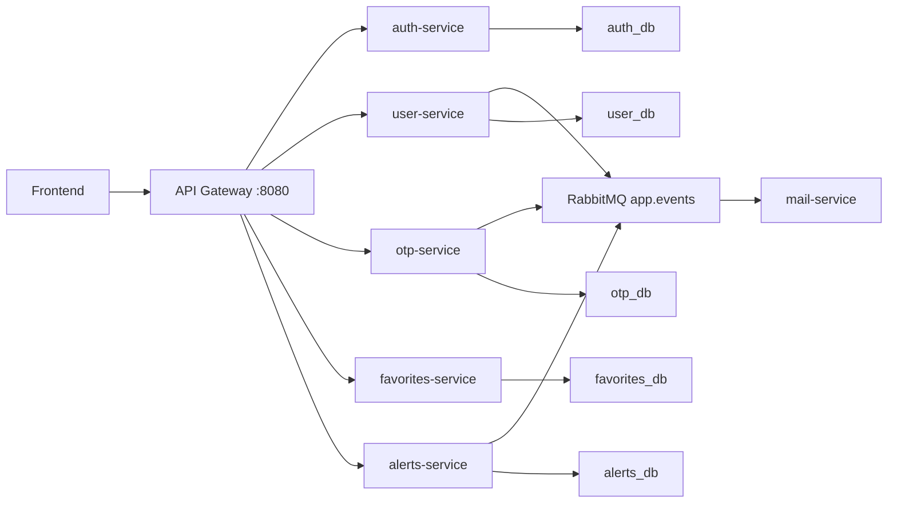

# Backend Microservices Platform

Production-grade role-based backend built with Go, Python, PostgreSQL, RabbitMQ, Redis, PgBouncer, Docker, and GitHub Actions.

## What Is Included

- `api-gateway`: public entry point, JWT verification, CORS, request limits, reverse proxying.
- `auth-service`: manual login, Google OAuth, RS256 access tokens, refresh token rotation, logout.
- `user-service`: signup, profile, roles, account state, gouvernorats, internal user APIs.
- `otp-service`: email verification, 2FA, password reset.
- `favorites-service`: authenticated product favorites.
- `alerts-service`: product alert CRUD and internal trigger pipeline with outbox dispatch.
- `mail-service`: RabbitMQ consumers, Jinja2 email templates, SMTP/SendGrid delivery.
- `shared`: Go helpers for responses, errors, logging, validation, DB, JWT, RabbitMQ, middleware, health.

## Architecture

The only public application port is the API Gateway. All frontend traffic goes through the gateway; service-to-service traffic uses internal Docker networking and `X-Internal-Secret`.



## Local Development

Copy `.env.example` to `.env`, fill required secrets for local Docker, then run:

```bash
docker compose -f docker-compose.yml -f docker-compose.dev.yml up -d --build
curl http://localhost:8080/health
```

Dev compose exposes service ports and Mailpit for debugging. Production compose exposes only the gateway.

## Production Deployment

The VPS setup is in `infra/scripts`. Stateful services run on the host: PostgreSQL, Redis, RabbitMQ, Nginx. App services run as Docker containers from GHCR.

1. Run `infra/scripts/01-system.sh` through `07-pgbouncer.sh` on a fresh Ubuntu VPS.
2. Fill `/etc/app/secrets/.env` using `.env.production.example` as the reference.
3. Copy RS256 keys to `/etc/app/secrets/keys/private.pem` and `/etc/app/secrets/keys/public.pem`.
4. Set GitHub Actions secrets: `VPS_HOST`, `VPS_SSH_KEY`, `GHCR_TOKEN`.
5. Push to `main`; CI builds and deploys all services.

See `docs/DEPLOYMENT.md` for the full production checklist.

## Documentation

- `docs/API_REFERENCE.md`: endpoints, auth, payloads, and error behavior.
- `docs/FRONTEND_INTEGRATION.md`: frontend login, refresh, OTP, favorites, alerts, CORS, cookies.
- `docs/DEPLOYMENT.md`: VPS and GitHub Actions deployment.
- `docs/OPERATIONS.md`: health checks, logs, rollback, recovery checks.
- Swagger UI: `GET /docs` when `DOCS_ENABLED=true`.
- OpenAPI spec: `GET /openapi.yaml`.

## Verification

```bash
docker run --rm -v "${PWD}:/src" -w /src golang:1.23-alpine sh -c "go work sync && go test ./..."
docker run --rm -v "${PWD}/mail-service:/app" -w /app python:3.12-slim sh -c "pip install -r requirements.txt -q && python -m unittest discover -s tests -v"
docker compose -f docker-compose.prod.yml config --quiet
```

There is no Swagger UI served by the backend yet. The API reference docs are the source of truth for frontend integration.
