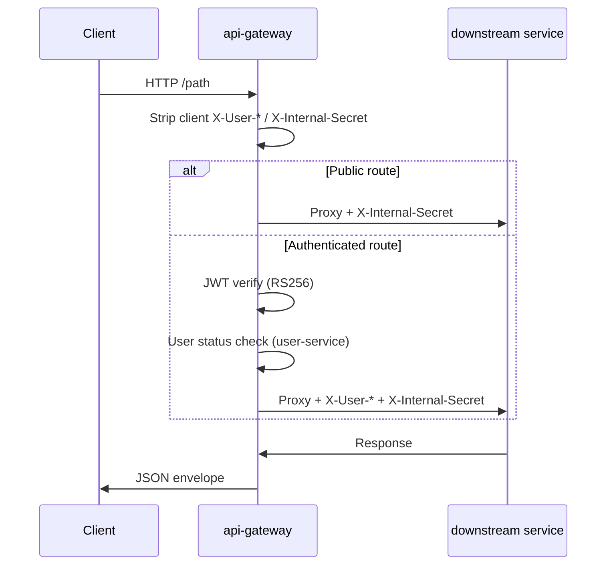

# Backend Technical Audit Report

**Date:** 2026-05-16  
**Scope:** `backend/` only (microservices, shared libs, compose, migrations)  
**Status:** Read-only audit — no code changes applied

---

## Executive Summary

The `backend/` folder is a **Go 1.23 microservices platform** (plus a Python mail worker) for what appears to be a Tunisia-focused app (`1111.tn`): user accounts, JWT auth with refresh cookies, email OTP (verify, 2FA, password reset), favorites, price/stock alerts, and async email via RabbitMQ.

Architecture is generally sound: API gateway as the only public HTTP entry, RS256 JWTs, refresh-token rotation with reuse detection, internal `X-Internal-Secret` between services, and per-service Postgres databases.

**The stack will not start cleanly in a fresh clone** without:

1. Generating JWT keys (`make keys` → `backend/secrets/jwt_*.pem`)
2. Setting `INTERNAL_SECRET` and DB passwords in `.env`
3. Running the full Docker Compose stack (Go is not available in your current shell)

Several auth-adjacent code paths are **inconsistent or dead** (legacy `two_factor_sessions` vs JWT pending tokens). The **live 2FA login path** (`POST /otp/2fa/login/verify` → `IssueJWT`) looks correctly wired, but **`POST /internal/auth/2fa/complete` is broken** if anything calls it.

---

## Architecture Overview

### Services

| Service | Port (default) | Role |
|---------|----------------|------|
| `api-gateway` | 8080 | Public edge: routing, JWT validation, CORS, rate limits, user status re-check |
| `auth-service` | 8081 | Login, Google OAuth, refresh/session cookies, JWT issuance, refresh-token DB |
| `user-service` | 8082 | Signup, profiles, admin user mgmt, credentials, outbox → RabbitMQ |
| `otp-service` | 8083 | OTP challenges, email verify, 2FA, password reset |
| `favorites-service` | 8084 | User product favorites |
| `alerts-service` | 8085 | User alerts + trigger/outbox |
| `mail-service` | (no HTTP) | RabbitMQ consumers → SMTP/SendGrid |

### Request Flow (Public)



**Entry point:** `api-gateway/cmd/main.go` → `router.New()` in `api-gateway/internal/router/router.go`.

Downstream services wrap routes with `shared/middleware.RequireInternalSecret` + `RequireUserContext` where needed (`shared/middleware/user_context.go` reads trusted headers set by the gateway).

### Shared Packages (`backend/shared/`)

- `config` — env + `*_FILE` secret loading
- `db` — pgx pool
- `password` — Argon2id
- `rabbit` — topic exchange `app.events`
- `httpjson` — uniform `{success, data|error, meta}` responses
- `userctx` — role helpers and header constants
- `apperr` — typed API errors

---

## Authentication & Token Flow

### Access Tokens (RS256 JWT)

- **Issued by:** `auth-service/internal/jwt/manager.go` → `IssueAccess()`
- **Claims:** `typ=access`, `sub` (user UUID), `role`, `email`, `auth_time`, `amr` (auth methods), `sid` (session UUID), `iss`, `aud`, `exp`
- **Validated by:** `api-gateway/internal/middleware/jwt.go` → `JWT()` — strict claim checks (all required fields must be present)

### Refresh Tokens

- Random 32-byte URL-safe string (`shared/token/token.go`)
- Stored as SHA-256 hash in `auth_db.refresh_tokens`
- HttpOnly cookie (`REFRESH_COOKIE_NAME`, default `refresh_token`, path `/auth`)
- **Rotation:** `auth-service/internal/repository/repository.go` → `RotateRefreshToken()` — revokes old token, detects reuse and revokes all user tokens
- **Endpoints:** `POST /auth/refresh`, `POST /auth/session`, `POST /auth/logout` (proxied through gateway)

### Login Flows

1. **Manual:** `auth-service` → `user-service` `/internal/users/lookup` → Argon2id verify → optional 2FA pending JWT → else token pair
2. **Google:** `idtoken.Validate` → `user-service` `/internal/users/google`
3. **2FA login:** pending JWT in `Authorization: Bearer` → `POST /otp/2fa/login/verify` → OTP verified → `auth-service` `/internal/auth/issue-jwt`

### Where Auth Can Fail

| Stage | Failure mode |
|-------|----------------|
| Startup | Missing `/run/secrets/jwt_public.pem` or private key (gateway/auth panic/fatal) |
| Login | User not verified → 403 `ACCOUNT_NOT_VERIFIED` |
| Login | `GOOGLE_CLIENT_ID` empty → Google login fails |
| Refresh | Cookie not sent (wrong domain/path/SameSite) → 401 |
| Refresh | JWT issuer/audience mismatch between gateway and auth |
| Protected routes | Gateway user-status check fails if `user-service` down |
| 2FA | Rabbit/mail down → OTP never emailed |
| Dead path | `POST /internal/auth/2fa/complete` uses DB `two_factor_sessions` but login never writes them |

---

## Environment & Configuration

### Required for Docker Compose (`backend/.env` from `.env.example`)

| Variable | Used by | Notes |
|----------|---------|-------|
| `INTERNAL_SECRET` | All services | **Required** (`:?` in compose); empty = internal calls fail |
| `AUTH_DB_PASSWORD`, `USER_DB_PASSWORD`, etc. | Postgres/PgBouncer | Defaults exist for dev |
| `JWT_ISSUER`, `JWT_AUDIENCE` | auth, otp, gateway | Must match everywhere |
| `CORS_ALLOWED_ORIGINS` | gateway (+ downstream CORS) | Production: no `*` |
| `REDIS_PASSWORD` | redis, gateway, mail | Built into `REDIS_URL` in compose |
| `RABBITMQ_USER`, `RABBITMQ_PASSWORD` | user, otp, alerts, mail | |
| `GOOGLE_CLIENT_ID` | auth-service | Required for Google login |
| Cookie vars | auth-service | `REFRESH_COOKIE_*`, `COOKIE_DOMAIN` |

### Files That Must Exist Before `compose-up`

- `backend/secrets/jwt_private.pem`
- `backend/secrets/jwt_public.pem`

**Observed state at audit time:** no `secrets/` directory in the repo. Compose references:

```yaml
# docker-compose.yml
secrets:
  jwt_private:
    file: ./secrets/jwt_private.pem
  jwt_public:
    file: ./secrets/jwt_public.pem
```

**Symptom:** `docker compose up` fails immediately (secret file not found).

**Fix:** Run `make keys` (runs `scripts/generate-dev-keys.ps1`).

### Production Extras (`docker-compose.prod.yml`)

Uses `INTERNAL_SECRET_FILE`, `REDIS_URL_FILE`, host Postgres via `host.docker.internal`, external network `app_internal`.

---

## Database Layer

### Per-Service Databases

| Service | DB | Main tables |
|---------|-----|-------------|
| user-service | `user_db` | `users`, `gouvernorats`, `outbox_events`, audit (migration 005) |
| auth-service | `auth_db` | `refresh_tokens`, `two_factor_sessions`, `audit_events` |
| otp-service | `otp_db` | `otp_codes`, `two_factor_challenges`, `password_reset_tokens`, `otp_rate_limits` |
| favorites-service | `favorites_db` | favorites |
| alerts-service | `alerts_db` | alerts + outbox |

Migrations run at startup when `MIGRATION_DATABASE_URL` is set (always in compose). Production without migration URL + `APP_ENV=production` → **fatal** (`migration_database_url_required`).

### Notable Schema Points

- Users: soft delete, unique email/username, roles `user|admin|superadmin`
- Refresh tokens: migration `003_refresh_auth_context.up.sql` adds `session_id`, `auth_time`, `auth_methods`
- OTP: migration `002` expands OTP types to `2fa_login|2fa_enable|2fa_disable` and adds `two_factor_challenges`

### Connection

`shared/db/db.go` — DSN via env `DB_HOST`, `DB_PORT`, `DB_NAME`, `DB_USER`, `DB_PASSWORD`, `DB_SSLMODE`. Compose uses PgBouncer on port 6432.

---

## Routes & Middleware

### Gateway Route Registration (`api-gateway/internal/router/router.go`)

**Public:** login, google, session, refresh, logout, signup, gouvernorats, OTP email/password-reset, 2FA login verify

**Authenticated:** profile, password, 2FA enable/disable, favorites, alerts

**Admin:** user list/detail/ban/role/delete, admin favorites/alerts

**Per-route middleware order (authenticated):** rate limit → JWT → user status → reverse proxy

**Global middleware (outer):** recovery → strip sensitive headers → request ID → security headers → CORS → timeout → logging → body limit → origin check (cookie routes)

### Downstream Middleware (Typical)

`Recovery → RequestID → SecurityHeaders → CORS → RateLimit → HTTP logging` (from each `cmd/main.go`)

### Proxy Behavior (`api-gateway/internal/proxy/proxy.go`)

- Strips `Authorization` and `Origin` before upstream
- Injects `X-Internal-Secret`
- Maps `Authorization` → `X-2FA-Pending-Token` only for `POST /otp/2fa/login/verify`
- Strips duplicate CORS/security headers from upstream responses

---

## Bugs Found

### Critical

| # | File / function | Issue | Symptom | Fix |
|---|-----------------|-------|---------|-----|
| C1 | `docker-compose.yml` secrets + missing `backend/secrets/` | JWT PEM files absent | Compose/build fails; auth & gateway cannot start | Run `make keys`; do not commit private keys |
| C2 | `auth-service/internal/service/service.go` → `CompleteTwoFactor()` | Calls `repo.ConsumeTwoFactorSession(SHA256(sessionToken))` but login 2FA uses **JWT** pending tokens, never `CreateTwoFactorSession()` | `POST /internal/auth/2fa/complete` always returns invalid 2FA session | Rewrite to verify JWT via `jwtManager.VerifyPendingTwoFactor()` or remove endpoint; align with `VerifyLoginTwoFactor` path |
| C3 | Fresh `.env` without `INTERNAL_SECRET` | Compose interpolation fails | `docker compose up` refuses to start | Set `INTERNAL_SECRET` in `.env` before compose |

### High

| # | File / function | Issue | Symptom | Fix |
|---|-----------------|-------|---------|-----|
| H1 | `api-gateway/internal/proxy/proxy.go` → `Director` | `X-Forwarded-Proto` hardcoded to `"http"` | Wrong proto behind TLS/nginx; can break secure cookie/policy assumptions | Set from `r.TLS != nil` or `X-Forwarded-Proto` from trusted proxy |
| H2 | Production cookie config (`.env.example`) | `COOKIE_DOMAIN=backend.1111.tn`, frontend at `1111.tn` | Refresh cookie only on API host (by design); misconfigured frontend base URL → no session | Ensure frontend calls `https://backend.1111.tn` with `credentials: 'include'` |
| H3 | `api-gateway/internal/middleware/ratelimit.go` | Redis errors → **allow request** (fail-open) | No rate limiting when Redis down | Fail closed for auth/OTP routes or alert on Redis loss |
| H4 | `auth-service/cmd/main.go` + compose | Base compose sets `APP_ENV: production` until `docker-compose.dev.yml` overlay | Stricter validation, migration requirements in “local” compose | Set `APP_ENV=development` in base or document two-file compose requirement |
| H5 | RabbitMQ + mail dependency | Signup publishes `user.created` → OTP consumer sends verify email | No email if Rabbit/mail down; users stay unverified → login 403 | Monitor outbox/consumer health; surface signup “check email” only when publish succeeds |
| H6 | `user-service/internal/handler/handler.go` → `internalGetByID` | Returns `Credential()` including `password_hash` to gateway status check | Unnecessary hash exposure on internal network | Return a slim DTO without `password_hash` for `/internal/users/{id}` when used for status |

### Medium

| # | File / function | Issue | Symptom | Fix |
|---|-----------------|-------|---------|-----|
| M1 | `auth-service/internal/service/service.go` → `Logout()` | Empty refresh token → success (no-op) | Client thinks logout worked but sessions may remain | Return 401 or accept only if access token revoked |
| M2 | `otp-service/internal/service/service.go` → `SendEmailVerificationByEmail` | Unknown email returns `nil` (silent) | Same as intentional anti-enumeration; can confuse debugging | Document; optional constant-time delay |
| M3 | `otp-service/internal/service/consumer.go` → `AutoSendEmailVerification` | Google users created `is_verified=true` get no welcome email | No welcome mail for Google signups | Publish separate `welcome` event on `user.created` when verified |
| M4 | `shared/middleware/security.go` + gateway | `Strict-Transport-Security` on all responses including local HTTP | Browser HSTS quirks in dev | Disable HSTS when `APP_ENV=development` |
| M5 | `shared/middleware/cors.go` (downstream services) | Empty `ALLOWED_ORIGINS` → reflect any Origin | Misconfiguration opens CORS on direct service port access | Require explicit origins in production |
| M6 | `api-gateway` vs `docs/API_REFERENCE.md` | Docs mention `token_type`, `expires_in`; API returns `access_token_expires_at` | Frontend integration bugs | Align docs or response shape |
| M7 | `auth-service` | `CreateTwoFactorSession` / `two_factor_sessions` table unused in live flows | Dead schema/code complexity | Remove or document legacy path |

### Low

| # | File / function | Issue | Symptom | Fix |
|---|-----------------|-------|---------|-----|
| L1 | `user-service/internal/service/service.go` → `Signup()` | Passes `"user_id": ""` in outbox payload | None (repository patches ID in `CreateUserWithOutbox`) | Pass `user.ID` after create for clarity |
| L2 | `otp-service/cmd/main.go` | Consumer uses parent `ctx` cancelled on shutdown | Benign race on shutdown | Pass derived context |
| L3 | Dev shell | `go` not in PATH | Cannot run `make test` locally without Docker | Install Go 1.23 or use `make docker-test` |

---

## Security Issues

| Area | Finding | Severity |
|------|---------|----------|
| Header injection | Gateway strips `X-User-*`, `X-Internal-Secret` from clients (`strip.go`) | Good |
| JWT | RS256, issuer/audience enforced, `typ=access` required on protected routes | Good |
| Refresh tokens | Hashed at rest, rotation + reuse detection | Good |
| Internal API | `subtle.ConstantTimeCompare` on internal secret | Good |
| Internal API | Empty `INTERNAL_SECRET` allowed outside production | **High** if services exposed |
| Passwords | Argon2id with env-tunable params | Good |
| OTP | bcrypt hashes, attempt limits, rate limits | Good |
| CORS | Credentials + explicit origins in prod gateway config | Good |
| Rate limit | Fail-open on Redis failure | **Medium** |
| Credential leak | Internal user endpoint returns `password_hash` | **Medium** |
| Dead endpoint | `/internal/auth/2fa/complete` broken | **Low** (not wired from OTP) |
| Docs | Public Swagger when `DOCS_ENABLED=true` | Disable in prod if undesired |
| Enumeration | Password reset / email verify hide user existence | By design |

---

## Missing Pieces

1. **`backend/secrets/jwt_*.pem`** — not in repo (expected), must be generated locally
2. **Populated `backend/.env`** — template exists; secrets empty
3. **Go toolchain** — not installed in audit environment (tests unverified via local `go test`)
4. **Runtime logs/errors** — not provided; cannot confirm live failure mode
5. **`CompleteTwoFactor` / `two_factor_sessions`** — legacy path not integrated with current JWT 2FA design

---

## Recommended Fix Plan

### 1. Fix critical runtime blockers

1. Run `make keys` to create `backend/secrets/jwt_private.pem` and `jwt_public.pem`
2. Copy `backend/.env.example` → `backend/.env`; set `INTERNAL_SECRET` (e.g. `openssl rand -hex 32`) and DB passwords
3. Start stack: `make compose-up` (uses `.env` + `docker-compose.yml` + `docker-compose.dev.yml`)
4. Verify: `curl http://localhost:8080/health`

### 2. Fix auth / token flow

1. Fix or remove `CompleteTwoFactor` and `/internal/auth/2fa/complete`
2. Validate cookie settings against your real frontend URL (domain, path `/auth`, `Secure`, `SameSite`)
3. Confirm `JWT_ISSUER` / `JWT_AUDIENCE` identical on gateway, auth, otp

### 3. Fix DB / config

1. Ensure migrations ran (check service logs for `migration_failed`)
2. Confirm PgBouncer health before app services
3. For production: set `MIGRATION_DATABASE_URL` policy explicitly

### 4. Fix security

1. Fix `X-Forwarded-Proto` in proxy
2. Tighten rate limit behavior when Redis unavailable
3. Remove `password_hash` from internal status profile response
4. Set `DOCS_ENABLED=false` in production if needed

### 5. Add tests / logging / validation

1. Run `make docker-test` and `make python-test`
2. Add integration test for full signup → email verify → login
3. Monitor Rabbit outbox lag and `otp.user.created` consumer errors

---

## Questions / Assumptions

### Assumptions (not verified without running the stack)

- Deployment uses Docker Compose with documented `.env` and generated secrets
- Frontend uses `https://backend.1111.tn` (or local `localhost:8080`) with credentials for cookie auth
- Nginx terminates TLS in production (not shown in `backend/` alone)

### Questions (only where code cannot answer)

1. What exact symptom are you seeing (startup crash, 401, 403, 502, missing emails)? Runtime logs would pinpoint which item above applies.
2. Are you running `docker-compose.dev.yml` overlay or only `docker-compose.yml`?
3. Is the frontend calling the API on the same site as the refresh cookie domain?

### To refine this report further, provide

- `docker compose` startup logs (especially auth-service, api-gateway, otp-service)
- A failing HTTP request (method, path, status, response body)
- Your actual `.env` key names only (not values) and whether `secrets/` exists locally

---

## Bottom Line

The design is production-oriented and mostly coherent, but a fresh clone **cannot run** until JWT secrets and `INTERNAL_SECRET` exist. The most likely **logic bug** in code (not deployment) is the orphaned `CompleteTwoFactor` / `two_factor_sessions` path versus the JWT-based 2FA flow actually used by `otp-service`. The live 2FA login path via `VerifyLoginTwoFactor` → `IssueJWT` appears correctly implemented in code review.
